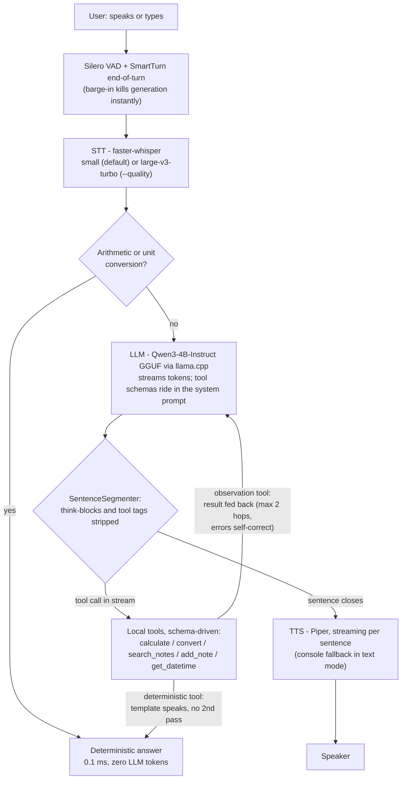

<div align="center">


# Snap

### On-device AI, in a snap.

**A fully-offline voice assistant for Snapdragon-powered HP PCs.**
Talk, it answers — tools included — and nothing ever leaves the laptop.

[Quickstart](#quickstart) · [Benchmarks](#benchmarks) · [Architecture](#architecture) · [Troubleshooting](docs/troubleshooting.md)


</div>

## Why on-device

- **Private** — zero cloud calls after startup. Airplane mode is a demo beat, not a risk.
- **Snappy** — math, conversions, notes and date-time answer in **0.1 ms** via a deterministic
  router; conversation streams sentence-by-sentence as the LLM generates.
- **Agentic, honestly** — JSON-schema tools with a Hermes-style bounded loop that self-corrects.
  Both answer paths are benchmarked and labeled.
- **Built for Snapdragon** — every heavy stage quantized and bound for the Hexagon NPU.
  English + Hindi/Hinglish.

## Quickstart

**1. Environment**

```bash
uv venv && uv sync
```

**2. Model** (one-time — [preflight](src/snap/preflight.py) prints this same instruction if missing)

Download [Qwen3-4B-Instruct-2507 GGUF, Q4_K_M](https://huggingface.co/Qwen/Qwen3-4B-Instruct-2507-GGUF)
→ `data/models/qwen3-4b-instruct/`. Whisper auto-downloads; VAD/turn models ship with pipecat.

**3. Run**

```bash
uv run snap chat --text            # typed: LLM + tools + sentence streaming
uv run snap chat --mic             # voice: Silero VAD, STT, LLM, TTS, barge-in
uv run snap chat --mic --quality   # Whisper-Large-V3-Turbo STT
uv run snap bench                  # per-stage medians -> bench_results.json
```

Try: *"What is 15% of 2400?"* (0.1 ms) · *"Remember that my exam is on Friday"* →
*"What's in my notes about the exam?"* · flip airplane mode mid-conversation.

Dev: `uv run pytest` · `uv run ruff check .`

## Architecture



One runtime: pipecat owns the loop (VAD, turn-taking, barge-in); Snap owns the two NPU-bound
stages as custom services. The NPU build swaps their **internals** — QNN w8a16 Whisper
(ONNX Runtime + QNN EP) and a GenieX/QAIRT LLM — behind the same classes, no pipeline changes.
AI Hub profiling: [scripts/profile_on_aihub.py](scripts/profile_on_aihub.py) → evidence in
[docs/evidence/](docs/evidence/).

## Benchmarks

CPU medians on the dev laptop (x64, `snap bench`, fresh-session runs). NPU figures are
Qualcomm AI Hub published numbers for X2 Elite — to be confirmed by our own profile jobs.
Full two-tier methodology: [docs/benchmarks.md](docs/benchmarks.md).

| Stage | CPU (measured) | Snapdragon NPU (AI Hub) |
|---|---|---|
| Tool answers (deterministic) | **0.1 ms** | same |
| LLM first token | 3,858 ms | ~150–400 ms |
| LLM full reply | 11,787 ms | ~2.5–3.5 s (42.6 tok/s decode) |
| STT (3 s utterance) | — | ~190 ms |
| TTFA (voice, end-to-end) | pending mic probe | ~0.9 s composed |

## Layout

```
src/snap/pc/           pipecat services (STT/LLM/TTS), pipeline, TTFA probes
src/snap/tools.py      the agentic surface: schema registry + bounded Hermes loop
src/snap/preflight.py  boot checks: friendly exits, never tracebacks
docs/                  benchmarks + evidence      scripts/   AI Hub profiling
```

## Credits & license

MIT — see [LICENSE](LICENSE). Independent project, not affiliated with Snap Inc. or Qualcomm.
Built as an entry for the Snapdragon® AI Lab Build & Present Challenge 2026.
Sentence segmentation adapted from the author's [Yumii](https://github.com/CodeNeuron58/Yumii) (MIT).
