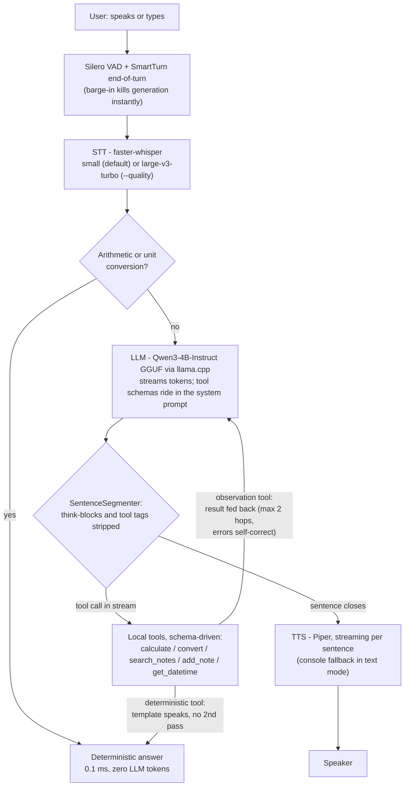

# Snap

[](https://github.com/CodeNeuron58/snap-voice/actions/workflows/ci.yml)

**Snap. On-device AI, in a snap.** A fully-offline, NPU-first voice assistant built for
**Snapdragon-powered HP PCs** (Windows on Snapdragon ARM64, HP OmniBook class): conversation plus
a small local tool layer (calculate, convert, remember & search notes, date & time), with every
heavy stage quantized and bound for the Hexagon NPU. Built as an entry for the
Snapdragon® AI Lab Build & Present Challenge 2026.

> Independent open-source project. Not affiliated with Snap Inc. or Qualcomm.

## Quickstart (Day-1 CPU spike)

```bash
# 1. environment (uv) — venv, then sync: installs ALL runtime deps + this package editable
uv venv
uv sync

# 2. models — put the GGUF in data/models/qwen3-4b-instruct/ (see Troubleshooting if
#    missing); Whisper auto-downloads on first run; the VAD/turn models ship with pipecat.
#    Optional: set PIPER_VOICE in src/snap/config.py to a piper .onnx voice for real
#    audio out (otherwise console fallback).
# 3. run
uv run snap chat --text            # typed: LLM + tools + sentence streaming (no audio deps)
uv run snap chat --mic             # full voice pipeline: Silero VAD, STT, LLM, TTS, barge-in
uv run snap chat --mic --quality   # Whisper-Large-V3-Turbo STT (better accuracy, TTFA ~1.4s)
uv run snap bench                  # fixed 10-prompt set -> per-stage medians -> bench_results.json
uv run snap bench --no-preroute    # measure the LLM tool-JSON path (pre-router off)

# later, for AI Hub profiling (challenge evidence): uv sync --extra aihub
```

## Architecture



### One runtime; NPU slots in behind the same classes

Snap runs on a single runtime: pipecat owns the loop (transport, VAD, turn-taking,
interruptions); Snap owns the two NPU-bound stages as custom pipecat services plus per-stage
latency probes. The NPU build swaps the **internals** of those services — QNN w8a16 Whisper via
ONNX Runtime + QNN EP, GenieX/QAIRT for the LLM — behind the same classes, with no pipeline
changes (`scripts/profile_on_aihub.py` produces the hosted-device evidence).

**Target hardware:** the Hexagon NPU in Snapdragon X / X2 Elite (the silicon of Snapdragon-powered
HP OmniBooks, Windows on Snapdragon ARM64). The current CPU spike runs the identical interfaces on
x64 today; the NPU runtimes slot in behind the same classes with no pipeline changes
(`scripts/profile_on_aihub.py` produces the hosted-device evidence).

### Version notes (pipecat moves fast — read before first import)

Coded against recent pipecat docs: `pipecat.transports.local.audio.LocalAudioTransport`,
`pipecat.audio.vad.silero.SileroVADAnalyzer`, `LLMService._process_context`, and the
`OpenAILLMContext`/`LLMContext` aggregator pair (both supported via a shim in
`snap/pc/services.py`). If an import fails on your installed version, the fix is almost
always the module path — check `pipecat.services.*` in your venv and adjust.

## Troubleshooting

- **"LLM model file not found"** — `data/models/` is gitignored, so a fresh clone has no
  models. Download `qwen3-4b-instruct-2507-q4_k_m.gguf` (Qwen/Qwen3-4B-Instruct-2507-GGUF,
  the Q4_K_M quant) into `data/models/qwen3-4b-instruct/`, or uncomment the 1.7B fallback
  line (`LLM_GGUF`) in `src/snap/config.py`. Details: Quickstart step 2.
- **"Whisper ... failed to load"** — Whisper auto-downloads from Hugging Face on first run.
  All HF traffic is routed via the `hf-mirror.com` mirror by default (`HF_ENDPOINT`
  override in `src/snap/config.py`); check connectivity, or pre-download the model.
- **"no microphone found" / audio errors** — check Settings → Sound for a working input
  device, or use typed mode: `snap chat --text`.
- **`silero_vad.onnx` not found** — no longer applicable: the VAD and turn models ship with
  pipecat's extras; nothing to fetch by hand.
- **pipecat import errors** — pipecat moves fast; see "Version notes" above. The fix is
  almost always the module path.
- **llama-cpp-python install is slow or fails** — PyPI has no Windows wheel, so
  `pyproject.toml` pins a prebuilt `win_amd64` wheel; on other platforms uv compiles it
  from source (~30 min, needs CMake + a C++ toolchain).

## Repo layout

Modern `src/` layout — the installable package lives in `src/snap/`, runtime data stays at the root.

- `src/snap/pc/` — **the product path**: pipecat services (STT/LLM/TTS), mic pipeline, text mode, TTFA probes
- `src/snap/tools.py` — the entire agentic surface (schema registry, Hermes-style bounded loop, deterministic and local)
- `src/snap/preflight.py` — boot checks: missing model / no mic exit with the fix, not a traceback
- `src/snap/timing.py` — per-stage timers; `snap bench` emits the submission benchmark table
- `docs/` — `benchmarks.md` (methodology + numbers) and `evidence/` (raw AI Hub profiles)
- `scripts/` — `profile_on_aihub.py` (AI Hub hosted-device profiling harness)
- `data/` — runtime-only (gitignored models, sample notes) — never published

## Challenge docs

Strategy, build plan, submission checklist: kept separately in the ZCode workspace under
`snapdragon-challenge/` (`C:\Users\bipra\.zcode\workspace\default\snapdragon-challenge`).

## Credits

A small utility module (sentence segmentation with think-block stripping) is adapted from the
author's earlier MIT open-source project [Yumii](https://github.com/CodeNeuron58/Yumii); everything
else — the on-device model stack, pipeline, and tooling — was built new for this challenge.

## Development

```bash
uv sync               # full env incl. dev tools (ruff, pytest)
uv run pytest         # unit tests — pure logic only, no models or audio deps needed
uv run ruff check .   # lint (CI gates on this)
```

## License

MIT.
